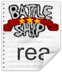

# Space Battle-Insper [](https://github.com/DaviReisVieira/Bomberman-Insper)
> Um jogo em Python para o Projeto Final de Design de Software

Projeto Final de Design de Software 2020.1 - 1C

[](https://pypi.python.org/pypi/pygame)
[](https://pypi.python.org/pypi/pygame)
[](https://www.python.org/)

**MEMBROS**
- Davi Reis Vieira de Souza

- Francisco Pinheiro Janela

- Nicolas Maciel Queiroga

**DESCRIÇÃO**

Joguinho em Python para Projeto Final.

Iremos realizar uma versão utilizando a biblioteca PyGame para o projeto.

**LINGUAGEM UTILIZADA**
- Python

**METAS**
- [x] Aprender a usar o Github
- [x] Trabalho em Equipe
- [ ] Divisão das Tarefas

## Instalação

<details><summary><b>Mostrar Tutorial</b></summary>

1. Clone o repositório:

    ```
    git clone https://github.com/DaviReisVieira/Space-Battle-Insper
    ```

2. Execute o arquivo main.py

</details>