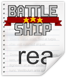

# Battle Ship-Insper [](https://github.com/DaviReisVieira/Space-Battle-Insper)
> Um jogo em Python para o Projeto Final de Design de Software

Projeto Final de Design de Software 2020.1 - 1C

[](https://pypi.python.org/pypi/pygame)
[](https://pypi.python.org/pypi/pygame)
[](https://www.python.org/)

**MEMBROS**
- Davi Reis Vieira de Souza

- Francisco Pinheiro Janela

- Nicolas Maciel Queiroga

**LINGUAGEM UTILIZADA**
- Python

**METAS**
- [x] Aprender a usar o Github
- [x] Trabalho em Equipe
- [x] Divisão das Tarefas
- [x] Realização do Background
- [x] Adicionando asteróides
- [x] Adicionando naves
- [x] Adicionar física de colisão
- [x] Criar Menu 
- [x] Itens Adicionais
- [x] Easter Egg(?)
- [x] Adicionar sons

## Descrição

Battle Ship é um jogo em Python feito com a biblioteca PyGame para o Projeto Final de Design de Software 2020.1.

Em uma realidade muito, muito distante, a onda de um vírus intergalático devastador chegou ao fim. Com isso, a sociedade iniciou seu processo de retomada. Porém, estudantes da faculdade SpaceInsper divergiram suas ideias e alguns queriam continuar o estilo Intergalático Ensino à Distância, IEaD, enquanto outros queriam retornar às aulas presenciais no planeta Tinsper. Nisso, uma guerra espacial começou...


O jogo tem como objetivo **destruir** o oponente para dar um fim à guerra.

## Vídeo de funcionamento:

Devido a problemas com o som será compartilhado em dois vídeos:

- com som, porém com poucos frames: https://web.microsoftstream.com/video/8cd4d1a7-f568-4c06-a2cb-7b6c799fc167

- sem som: https://www.youtube.com/watch?v=tsSIi2Qt6Qc&feature=youtu.be

## Requisitos

1. Instale o Python 3.x

2. Instale a biblioteca PyGame 1.9.x

3. Clone o repositório:

## Instalação

<details><summary><b>Mostrar Tutorial</b></summary>

1. Clone o repositório:

    ```
    git clone https://github.com/DaviReisVieira/Battle-Ship-Insper
    ```

2. Execute o comando python BattleShip.py

</details>

## Easter Egg

1. Em config > CORONA > True
